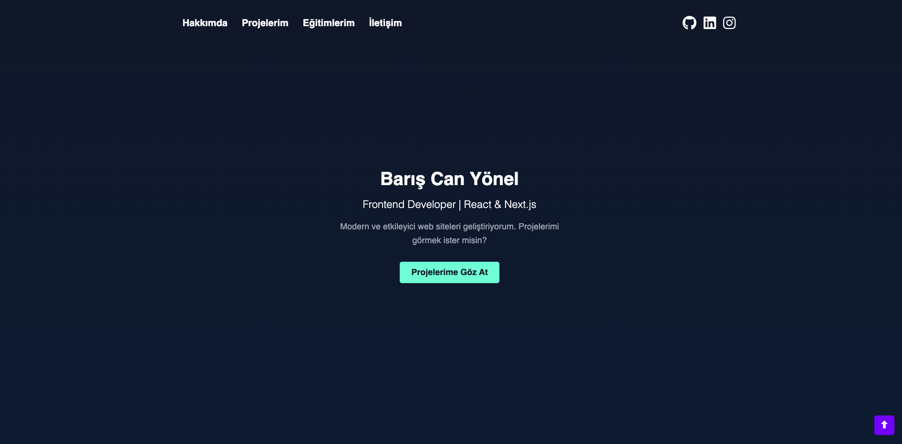
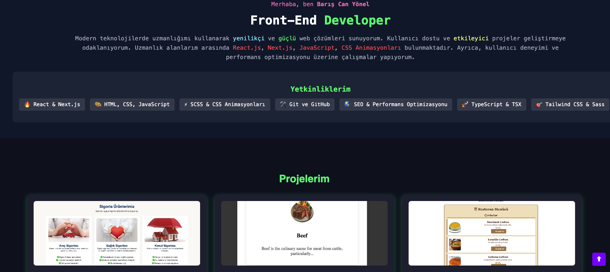

## 🚀 Teknolojiler

Bu projede kullanılan başlıca teknolojiler şunlardır:

- **React** (Vite ile optimize edilmiş hızlı yapı)
- **JavaScript (ES6+)**
- **CSS3** (Özel stillendirme ve animasyonlar)
- **AOS (Animate On Scroll)**
- **Formspree** (İletişim formu için)
- **GitHub API** (Projeleri dinamik listeleme)
- **SEO Optimizasyonu** (Meta etiketleri ve yapılandırılmış veri)

---

## 📌 Özellikler

- **📌 Modern Tasarım:** Kullanıcı dostu, sade ve şık arayüz.
- **💡 Projeler Bölümü:** GitHub bağlantılarıyla canlı önizleme.
- **🏆 Sertifikalar:** LinkedIn ve diğer eğitim sertifikalarının listelenmesi.
- **📩 İletişim Formu:** Formspree ile doğrudan e-posta gönderme.
- **🌍 Responsive Tasarım:** Tüm cihazlara uyumlu mobil, tablet ve masaüstü desteği.
- **🔍 SEO Uyumlu:** Open Graph meta etiketleri ile sosyal medya uyumluluğu.

---

## 📷 Proje Görselleri

## 📷 Proje Görselleri

## 📷 Proje Görselleri

